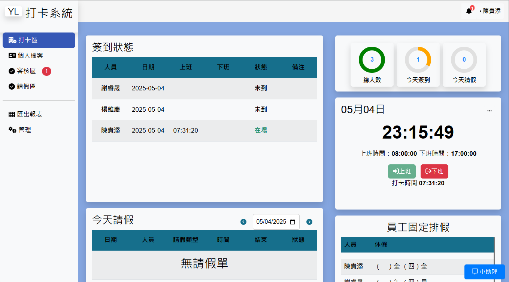
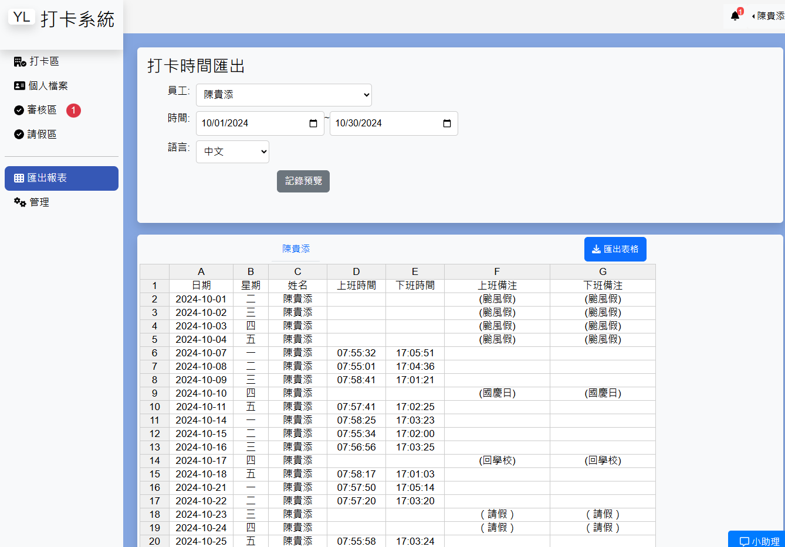
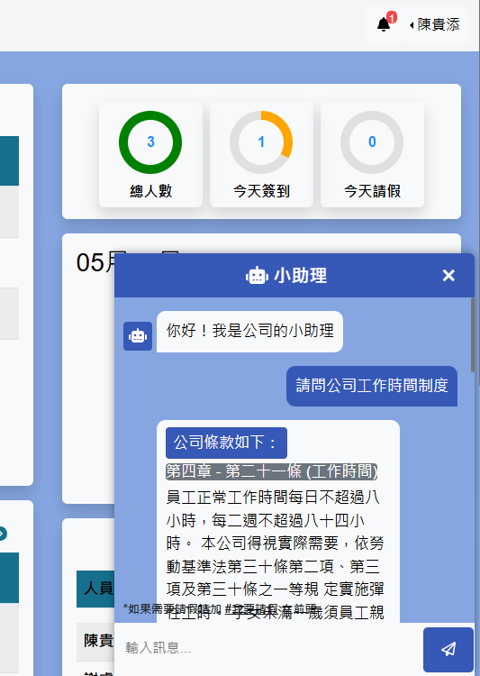
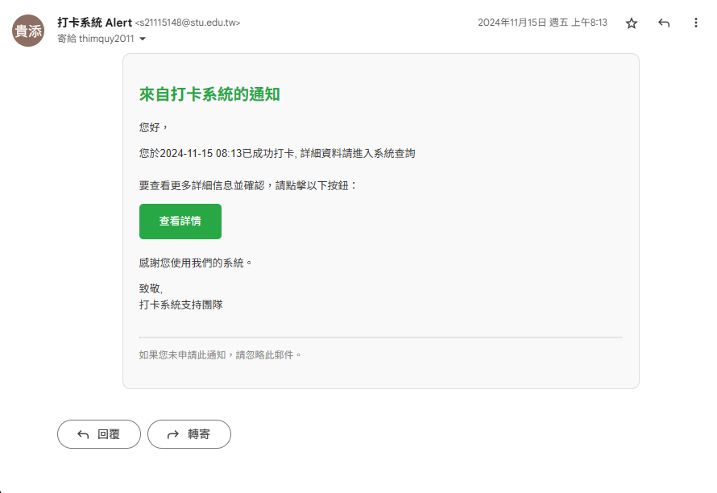
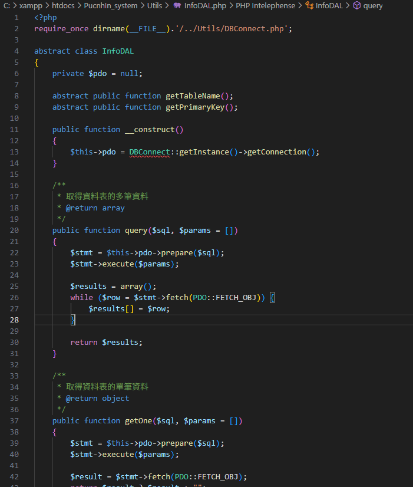
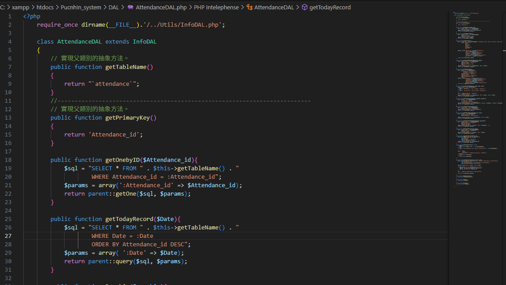
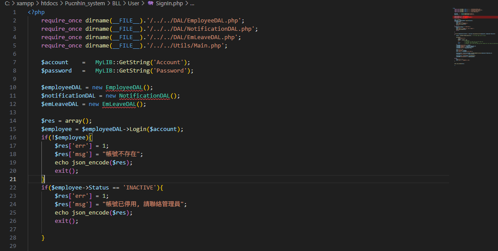

# 🕘 出勤管理系統 Attendance Management System

這是一套為企業實習生與員工設計的內部出勤管理系統，支援電子打卡、請假申請、出勤報表生成、權限分級、Email 通知以及內建 Chatbot 小助理，協助企業節省人事行政流程成本。

---

## 🚀 功能特色

- ✅ **電子打卡**：支援上班與下班時間記錄
- 📆 **請假申請與審批**：員工提交請假單，主管即時審核
- 📊 **出勤報表自動生成**：HR 可下載每日/每月報表
- 🗓️ **公司行事曆**：一覽重要日程與系統通知
- ✉️ **Email 通知整合**：打卡異常或請假結果即時寄信
- 🛡️ **多層級權限管理**：分為使用者，管理者
- 🤖 **小助理 Chatbot**：可查詢請假規範、公司制度等

---

## 🖼️ 系統畫面示意

### 🔐 登入頁面

### 📝 首頁打卡 主題顔色

### 📊 出勤報表頁面

### 🤖 小助理 Chatbot

### 📝 Email 樣本

### PDO 程式底層 

### DAL 資料層 

### BLL 邏輯層

---

## 🛠️ 技術棧 (Tech Stack)

| 類別 | 技術 |
|------|------|
| 後端 | PHP |
| 前端 | jQuery, Bootstrap, HTML, CSS |
| 資料庫 | MySQL |
| 工具 | Git |
| 架構 | 三層架構 (表示層 / 邏輯層 / 資料層) |

---

## 📂 專案結構簡介
出勤管理系統/
├── BLL/
│ └── [邏輯層]
├── Common/
│ └── [系統部分區塊，例如：header,footer,...]
├── css/
├── DAL/
│ └── [資料層]
├── Home/
│ └── [表示層]
├── Utils/
│ └ [系統底層，例如：PDO建立，單例模式資料庫，...]
├── images/
│ └── [示意圖放置處]
├── PHPMailer-master/
│ └── [發送Email套件]
├── README.md
└── ...

---

## 📥 使用方式

1. 匯入資料庫：使用 `/sql/schema.sql`
2. 配置資料庫連線資訊於 `DBpassword.php`
3. 透過瀏覽器打開 `index.php` 開始使用
4. 預設帳號密碼：可於頁面注冊新增/編輯帳號

---

## 💡 開發動機

這個系統原本是為了解決實習期間公司內部對於打卡與請假流程混亂的問題，後來也被實際導入到 HR 部門每日使用，提升人力資源管理效率。

---

## 🙌 作者資訊

由 [thimquy2011] 開發。  
本專案源自於 2024 實習期間獨立開發與設計。

